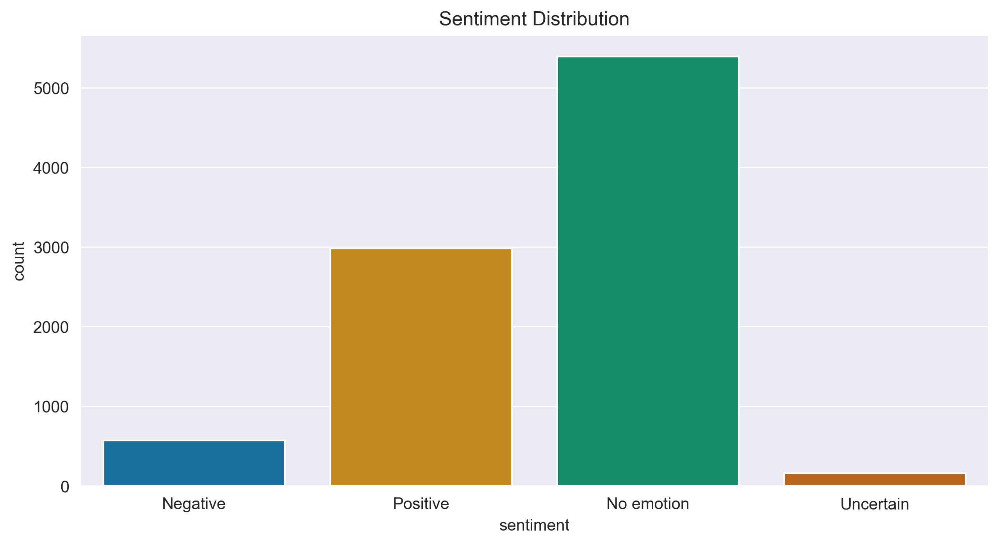
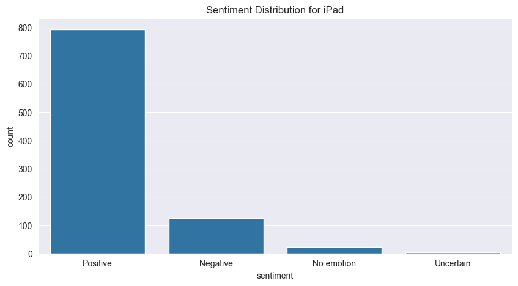
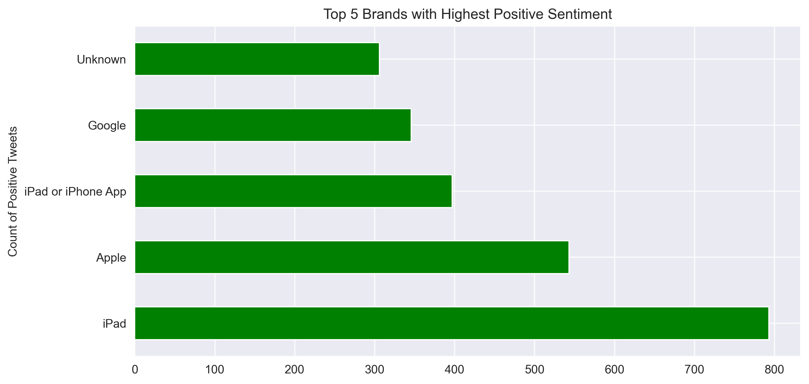
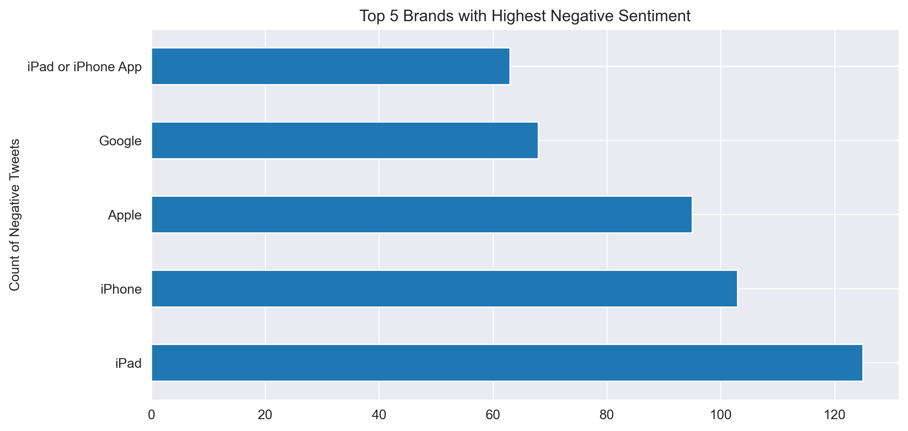

# 📊 **Product Brand Sentiment Analysis**

## 📌 **1.0 Overview**
This project focuses on analyzing Twitter sentiment towards tech brands and products during the SXSW 2011 conference. By leveraging Natural Language Processing (NLP) techniques and machine learning models, we aim to build an automated sentiment classification system. The goal is to help companies gain real-time, data-driven insights into public perception of their products and competitors.

## 🔍 **2.0 Business and Data Understanding**

### 🎯 **2.1 Stakeholder Audience**
The primary stakeholders include marketing teams, product managers, and brand strategists from tech companies. These stakeholders require timely and accurate insights into how their products are perceived online, especially during high-visibility events such as SXSW.

### 📁 **2.2 Dataset Description**
The dataset is sourced from CrowdFlower on Data.World. It includes:

`tweet_text:` The tweet content.
`emotion_in_tweet_is_directed_at`: The brand/product mentioned.
`is_there_an_emotion_directed_at_a_brand_or_product`: Sentiment label (Positive, Negative, No emotion, or I can't tell).

### 🧪 **2.3 Data Challenges**

Key challenges include:

- Analyzing unstructured text data from tweets to extract meaningful sentiment
- Handling ambiguous or sarcastic tweets that might be misclassified
- Dealing with imbalanced classes in sentiment categories
- Identifying which brands/products receive the most attention and strongest sentiment
- Developing a robust sentiment classification model that performs well across different brands

### 🎯 **2.4 Objectives**

- To explore the distribution of sentiment across different tech brands and products

- To analyze the relationship between brand category and sentiments

- To identify which brands/products generate the most positive/negative sentiment

- To build and evaluate a sentiment classification model that achieves good performance

- To create a deployable API for real-time sentiment analysis

## 🤖 **3.0 Modeling**
### 🔍**3.1 Data Preparation**
- Cleaned and preprocessed tweet text (removing URLs, mentions, special characters, etc.).
- Mapped raw sentiment labels to simplified categories: Positive, Negative, No emotion, and Uncertain.
- Dropped tweets labeled Uncertain to improve model clarity.

### 🔧 **3.2 Feature Engineering**
- TF-IDF Vectorization for text features.
- Handled class imbalance through data analysis and strategic filtering.

### 🧠 **3.3 Models Applied**
- Logistic Regression

- Random Forest Classifier
- Gradient Boosting Classifier
- XGBoost Classifier

## 📈**4.0 Evaluation**
*Metric Used:*
- Accuracy
- Confusion Matrix
- Classification Report (Precision, Recall, F1-score).

*Observations:*

- Logistic Regression performed well on linear decision boundaries.
- Tree-based models showed robustness to noise and handled class imbalance moderately.
- Gradient Boosting yielded the best performance overall in terms of F1-score.

## ✅**5.0 Conclusion**
This project successfully built a sentiment analysis pipeline that allows tech companies to track and interpret brand sentiment on social media. By focusing on tweets from a major event like SXSW, we were able to identify trends in customer emotion and brand visibility. 

