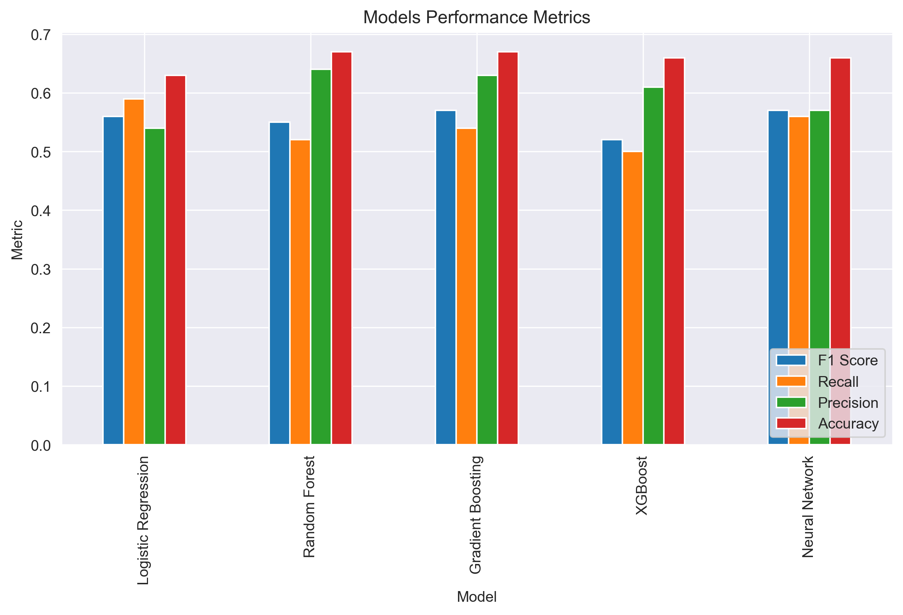

# 📊 **Product Brand Sentiment Analysis**

## 📌 **1.0 Overview**

This project focuses on analyzing Twitter sentiment towards tech brands and products during the SXSW 2011 conference. By leveraging Natural Language Processing (NLP) techniques and machine learning models, we aim to build an automated sentiment classification system. The goal is to help companies gain real-time, data-driven insights into public perception of their products and competitors.

## 🔍 **2.0 Business and Data Understanding**

### 🎯 **2.1 Stakeholder Audience**

The primary stakeholders include marketing teams, product managers, and brand strategists from tech companies. These stakeholders require timely and accurate insights into how their products are perceived online, especially during high-visibility events such as SXSW.

### 📁 **2.2 Dataset Description**

The dataset is sourced from CrowdFlower on Data.World. It includes:

`tweet_text:` The tweet content.
`emotion_in_tweet_is_directed_at`: The brand/product mentioned.
`is_there_an_emotion_directed_at_a_brand_or_product`: Sentiment label (Positive, Negative, No emotion, or I can't tell).

### 🧪 **2.3 Data Challenges**

Key challenges include:

- Analyzing unstructured text data from tweets to extract meaningful sentiment
- Handling ambiguous or sarcastic tweets that might be misclassified
- Dealing with imbalanced classes in sentiment categories
- Identifying which brands/products receive the most attention and strongest sentiment
- Developing a robust sentiment classification model that performs well across different brands

### 🎯 **2.4 Objectives**

- To explore the distribution of sentiment across different tech brands and products

- To analyze the relationship between brand category and sentiments

- To identify which brands/products generate the most positive/negative sentiment

- To build and evaluate a sentiment classification model that achieves good performance

- To create a deployable API for real-time sentiment analysis

## 🤖 **3.0 Modeling**

### 🔍**3.1 Data Preparation**

- Cleaned and preprocessed tweet text (removing URLs, mentions, special characters, etc.).
- Mapped raw sentiment labels to simplified categories: Positive, Negative, No emotion, and Uncertain.
- Dropped tweets labeled Uncertain to improve model clarity.

### 🔧 **3.2 Feature Engineering**

- TF-IDF Vectorization for text features.
- Handled class imbalance through data analysis, strategic filtering and SMOTE.

### 🧠 **3.3 Models Applied**

- Logistic Regression
- Random Forest Classifier
- Gradient Boosting Classifier
- XGBoost Classifier
- MLPClassifier (Neural Networks)

## 📈**4.0 Evaluation**

*Metric Used:*

- Accuracy
- Confusion Matrix
- Classification Report (Precision, Recall, F1-score).

*Key visualization:*

*Observations:* 

- `Logistic Regression` showed decent performance with the highest recall (0.59), indicating it’s effective at capturing most of the sentiment classes but at the cost of precision.
- `Random Forest` achieved the highest precision (0.64), meaning it made fewer false-positive sentiment predictions, though its recall was slightly lower.
- `Gradient Boosting` delivered the most balanced performance with strong F1 Score (0.56), precision (0.62), and recall (0.54), making it the best all-rounder.
- `Neural Network` maintained consistent scores across all metrics (around 0.55), suggesting reliability but no clear dominance.
- `XGBoost`, while often strong in other tasks, underperformed slightly across all metrics in this specific case.

## ✅ **5.0 Conclusion**

This project successfully developed a sentiment analysis pipeline tailored for analyzing product brand perception on Twitter. Among all models tested, Gradient Boosting emerged as the most balanced and effective, achieving a strong F1 score and competitive recall and precision.By applying this pipeline to tweets from a major tech event like SXSW, we were able to gain meaningful insights into how users express sentiment toward brands in real-time. This approach provides tech companies with a reliable tool to monitor public opinion, assess customer engagement, and make data-driven decisions for brand strategy.

